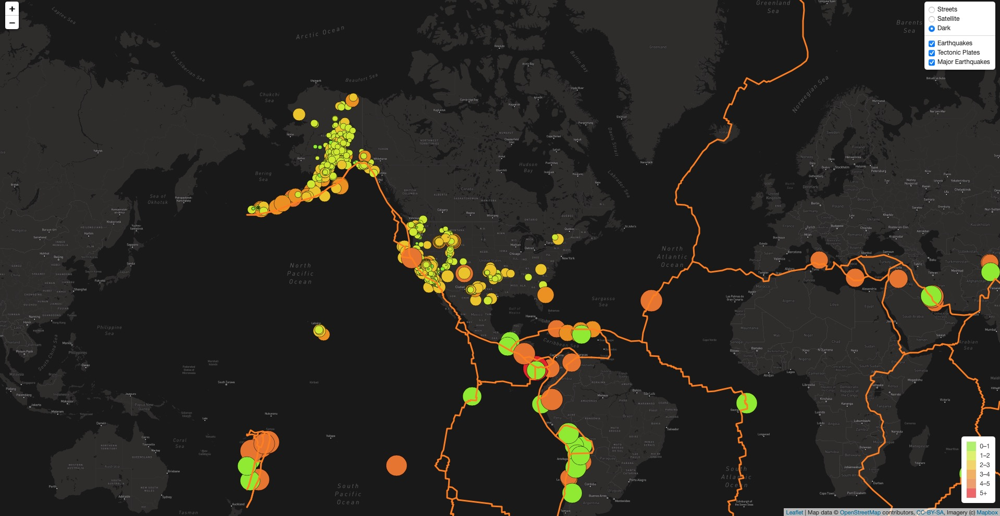

# Mapping_Earthquakes

# Mapping_Earthquakes

## Overview
- The purpose of this project is to visually show the differences between the magnitudes of earthquakes all over the world for the last seven days through using GeoJSON data.

### Results

